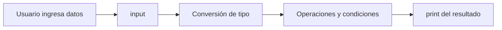

# Laboratorio I - Clase 1

## Descripción

Conjunto de ejercicios introductorios de Python (variables, tipos de datos, entrada por teclado, operaciones, condicionales, listas y bucles), versionados con Git en un commit por ejercicio. Está destinado a la práctica de la materia Laboratorio I y de control de versiones.

## Tecnologías utilizadas

- **Python 3**: lenguaje en el que están escritos todos los ejercicios.
- **Git**: control de versiones, con un commit por ejercicio.
- **GitHub**: repositorio remoto donde se publica el proyecto.
- **Markdown**: formato de este README.

## Características

- Entrada de datos por teclado con `input()` y conversión de tipos.
- Operaciones matemáticas básicas.
- Condicionales (`if`, `elif`, `else`).
- Listas y recorridos con `for` y `range`.

## Estructura del proyecto

```text
laboratorio1/
├── .gitignore
├── README.md
├── main.py
└── funciones.py
```

| Archivo | Función |
|---|---|
| `main.py` | Contiene los ejercicios 1 al 10 |
| `funciones.py` | TP de funciones: versión nombrada y anónima de 5 consignas |
| `.gitignore` | Evita versionar `__pycache__/`, `.env` y `*.log` |
| `README.md` | Documentación del proyecto |

## Requisitos

- Python 3.x
- Git

## Instalación

1. Clonar el repositorio:
   `git clone https://github.com/veroricard/laboratorio1.git`
2. Ingresar a la carpeta:
   `cd laboratorio1`

## Ejecución

```bash
python3 main.py
```

El programa pide datos por teclado en cada ejercicio y muestra los resultados por consola.

## Funcionamiento



## Problemas conocidos

- No se validan los datos ingresados: si se escribe texto donde se espera un número, el programa falla.
- La división no contempla el caso de dividir por cero.

## Mejoras futuras

- Validar las entradas del usuario.
- Separar cada ejercicio en funciones.

## Autores

| Integrante | Responsabilidad |
|---|---|
| veroricard | Desarrollo y documentación |

## Licencia

Este proyecto fue desarrollado con fines educativos.

## Conclusión

Se aplicaron los conceptos básicos de Python y el flujo de trabajo con Git (commits, ramas, `.gitignore` y repositorio remoto). Estos conceptos se pueden reutilizar en futuros proyectos.

## GitHub Helpers

- [GitDiagram](https://gitdiagram.com/veroricard/laboratorio1)
- [Gitingest](https://gitingest.com/veroricard/laboratorio1)
- [RepoGrep](https://repogrep.com/veroricard/laboratorio1)
- [DeepWiki](https://deepwiki.com/veroricard/laboratorio1)
- [GitHub1s](https://github1s.com/veroricard/laboratorio1/tree/main)
